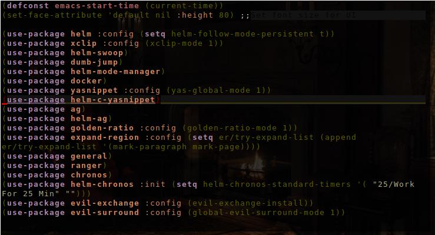

# My Emacs Configuration
> I love emacs. Lets share the love! If you are new to emacs check out the [Emacs Website](https://www.gnu.org/software/emacs/).


## How to use

1. Clone repo to ~/.emacs.d

```bash
git clone https://github.com/jessekelly881/.emacs.d ~/.emacs.d
```

2. Run emacs

```bash
emacs
```

**Warning** If you already have an emacs config be sure to back it up first.


## Contributing

If you wish to contribute please contact me at kellyjesse881@gmail.com or create a push request. I will try to review as quickly as possible.


## Some Useful Snippets

It is always enlightening to see other developers emacs config so here are a few code snippets that have been incredibly useful for me.

**Warning** I use emacs exclusively in the terminal with no GUI mode so these snippets may not play well with the GUI. You have been warned. Now, enjoy!

### Transparent Background
```lisp
(defun on-frame-open (&optional frame)
  "If the FRAME created in terminal don't load background color."
  (unless (display-graphic-p frame)
    (set-face-background 'default "unspecified-bg" frame)
    (set-face-background 'font-lock-comment-face "unspecified-bg" frame)
    (set-face-foreground 'linum "unspecified-bg" frame)
    ))

(add-hook 'after-make-frame-functions 'on-frame-open)
```



### Remove Stars in Org Mode

I love org mode! But.. the excessive *s are distracting. So, lets get rid of them!

```lisp
(defun org-mode-remove-stars ()
  (font-lock-add-keywords
   nil
   '(("^\\*+ "
      (0
       (prog1 nil
         (put-text-property (match-beginning 0) (match-end 0)
                            'invisible t)))))))

(add-hook 'org-mode-hook #'org-mode-remove-stars)
```

### Auto indent html and show tag pairs


```lisp
(defun my/web-mode-settings ()
  "Hooks for Web mode."
  (setq web-mode-markup-indent-offset 4)
  (setq web-mode-enable-current-column-highlight t)
)
(add-hook 'web-mode-hook  'my/web-mode-settings)
```

### Automatically add new lines to bottom of page. But remove them before save.

This is very very convenient(especially in evil mode which I use). It allows you to keep scrolling past the end of the buffer where you can insert text. But also, removes extra lines before save.


```lisp
(setq next-line-add-newlines t)
(add-hook 'write-file-hooks 'delete-trailing-whitespace)
```
